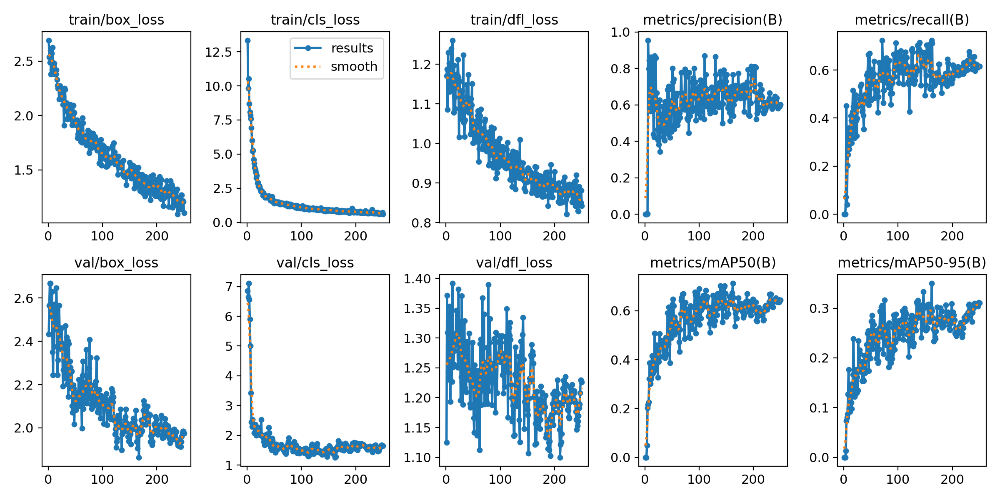

Салова Яна
https://drive.google.com/drive/folders/1TLnLkVY5UoUYNrMTDBKzWPqtNjq34f0-?usp=sharing


# Лабораторная работа 4
### 1. Разметка данных
Проанализировав датасет, я выбрала ряд разных видео-фрагментов, которые необходимы для обучения. 
Выполнила покадровое разбиение. Данные я сама размечала с помощью `Label Studio` по 4-ем классам:  `dark_entire`, `dark_broken`, `red_entire`, `red_broken`.
В итоговый датасет для обучения вошли ~500 изображений, и разбиты для обучения и теста на 80 и 20 процентов выборки соответственно. 
### 2. Обучение модели
Для обучения, а точнее, для дообучения была выбрана модель YoloV8 с исходными весами доступными [по ссылке](https://docs.ultralytics.com/models/yolo11/#key-features).
Обучение проводилось в 250 эпох, итоговые веса и метрики доступны в репозитории. 



### 3. Приложение
Далее был написан код, который принимает в параметрах запуска путь до папки с видео:
```
python3 main.py <path_to_folder_with_videos>
```
Каждое видео разбивается на кадры с определенным интервалом. В данном случае в модель поступают каждые 20-е кадры, т.к видео записаны с частотой в 40FPS. 
После обработки данные записываются в соотвествующий `csv` файл. 


Для лучшей оптимизации обработка видео выполняется в несколько потоков одновременно:
```
with ProcessPoolExecutor(max_workers=4) as executor:
    executor.map(run_model, args_list)
```
В итоге, в папке `results` создаются `csv` файлы для каждого видео, а не один общий файл. 
Объединять я их не стала, т.к оптимизированнее будет делегировать эту задачу на `Spark`-приложение.

Само `Spark`-приложение анализирует данные, сравнивает предыдущее состояние мишени с текущим и рассчитывает количество попаданий на видео.   

Результатом работы является лог, в котором указано видео с наибольшим количеством попаданий без промахов.

### 4. Вопросы
1. Что делать, если на видео будет присутствовать 2 мишени одновременно, как тогда адаптировать структуру данных под этот случай?

    В таком случае необходимо ввести новую колонку `target_id`, которая будет идентификатором для каждой мишени. Так мы сможем отслеживать каждую мишень по отдельности и не путать их друг с другом. Но также, для лучшего результата, стоит и выбрать другую модель, чтобы она сама присваивала нужный `target_id`. 

2. Что делать если на видео не будет мишеней в принципе, как тогда адаптировать структуру данных под этот случай?

    Данный случай обрабатывается тем, что в `csv` файл записывается пустой лог, где в полях, зависящих от наличия мишени, будет стоят `None`. Также данное решение обрабатывает кейс, когда модель ошибочно не определила, что на видео имеется мишень.


2. Что делать если на видео не будет мишений в принципе, как тогда адаптировать структуру данных под этот случай?

    Данный случай обрабатывается тем, что в `csv` файл записывает пустой лог, где в полях, зависящих от наличия мишени будет стоят `None`. Также данное решение обрабатывает кейс, когда модель ошибочно не определила, что на видео имеется мишень.

